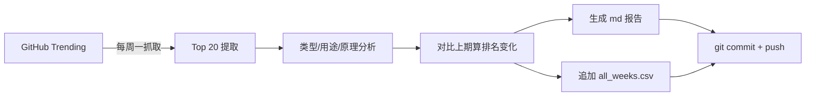

# 📡 oss-radar

> 每周自动追踪 GitHub 最受关注的开源项目，分析类型、用途与实现原理，追踪排名变化，洞察技术趋势。

[]()
[]()
[]()

---

## 这是什么

**oss-radar** 是一个每周自动运转的开源生态观察站。它每周一抓取 GitHub Trending 周榜 Top 20，对每个项目做三个维度的分析，并与历史数据对比追踪排名变化，最终产出一份结构化的趋势报告。

不只是一份榜单，而是一个**可累积、可检索、可对比**的开源趋势数据库。

## 每期报告包含什么

| 维度 | 说明 | 示例 |
|------|------|------|
| **排名** | 当期 Top 20 排名 | #1, #2, ... #20 |
| **排名变化** | 与上期对比的升降 | 🆕 新入榜 / ↑3 上升 / ↓2 下降 / — 持平 |
| **类型** | 项目所属技术类别 | AI Agent、代码智能、安全测试、投资研究 |
| **用途** | 一句话说清解决什么问题 | "将代码库索引为持久知识图谱" |
| **实现原理** | 核心技术实现思路 | "C 高性能解析器构建 AST+符号引用知识图谱" |
| **周增星标** | 本周新增 Star 数 | 10,483 |
| **总星标** | 历史总 Star 数 | 127,017 |
| **跨周趋势** | 多周排名汇总表 | 追踪项目从 #8 → #1 → #3 的走势 |
| **趋势洞察** | 3-5 条赛道分析 | "Agent 基础设施三巨头成型" |

## 数据结构

所有历史数据以 CSV 归档，便于用 pandas / Excel 任意检索分析：

```csv
week,rank,repo,language,weekly_stars,total_stars,category,purpose,principle
2026-W27,1,msitarzewski/agency-agents,Shell,10483,127017,AI Agent 角色库,...
2026-W27,2,DeusData/codebase-memory-mcp,C,10186,26140,代码智能 / MCP,...
```

**字段说明**：

| 字段 | 类型 | 说明 |
|------|------|------|
| `week` | str | ISO 周号，如 `2026-W27` |
| `rank` | int | 当期排名 (1-20) |
| `repo` | str | 仓库路径 `owner/repo` |
| `language` | str | 主要编程语言 |
| `weekly_stars` | int | 本周新增星标数 |
| `total_stars` | int | 总星标数 |
| `category` | str | 技术类型分类 |
| `purpose` | str | 一句话用途说明 |
| `principle` | str | 实现原理简述 |

一行 pandas 搞定常见分析：

```python
import pandas as pd
df = pd.read_csv("all_weeks.csv")

# 查某项目的完整排名历史
df[df.repo == "DeusData/codebase-memory-mcp"]

# 找所有多周上榜项目
df.groupby("repo").filter(lambda x: len(x) > 1)

# 按类型统计每期分布
df.groupby(["week", "category"]).size().unstack(fill_value=0)
```

## 目录结构

```
oss-radar/
├── README.md                  ← 本文件
├── all_weeks.csv              ← 全量历史数据（持续追加）
├── reports/                   ← 每期报告
│   ├── 2026-W23.md
│   ├── 2026-W24.md
│   ├── 2026-W25.md
│   ├── 2026-W26.md
│   └── 2026-W27.md
├── archives/                  ← 每期原始 JSON 快照（防误操作备份）
│   ├── 2026-W23.json
│   └── ...
└── docs/
    └── methodology.md         ← 数据采集与分析方法论
```

## 更新机制

- **频率**：每周一 09:00（Asia/Shanghai）
- **数据源**：`github.com/trending?since=weekly`
- **流程**：抓取 Trending → 分析三维度 → 计算排名变化 → 生成报告 → 追加 CSV → 提交归档



## 已覆盖周期

| 周期 | 时间范围 | 冠军项目 | 周增⭐ |
|------|----------|----------|-----:|
| 2026-W23 | 06.01 — 06.07 | chopratejas/headroom | 13,308 |
| 2026-W24 | 06.08 — 06.14 | mvanhorn/last30days-skill | 12,602 |
| 2026-W25 | 06.15 — 06.21 | chopratejas/headroom | 14,982 |
| 2026-W26 | 06.22 — 06.28 | calesthio/OpenMontage | 18,000 |
| 2026-W27 | 06.29 — 07.05 | msitarzewski/agency-agents | 10,483 |

## 如何使用

### 浏览报告

直接阅读 `reports/` 目录下的 md 文件，每期含完整 Top 20 榜单 + 跨周趋势观察。

### 数据分析

```bash
# 克隆仓库
git clone https://github.com/你的用户名/oss-radar.git

# 用 pandas 分析
python3 -c "
import pandas as pd
df = pd.read_csv('oss-radar/all_weeks.csv')
print(df.groupby('category').size().sort_values(ascending=False).head(10))
"
```

### 接入 Obsidian / 知识库

本仓库设计为可接入 Obsidian 等知识管理工具：
- 用 [Obsidian Git](https://github.com/Vinzent03/obsidian-git) 插件自动 pull
- 或用 git subtree 嵌入你的笔记仓库子目录

## 如何贡献

欢迎通过 PR 贡献：

- **补充分析**：对某期项目的用途/原理有更准确的理解，欢迎提交修正
- **新增分析维度**：如补充 `topics`、`license`、`company` 等字段
- **趋势洞察**：发现跨周期的有趣规律，欢迎补充到报告的"趋势观察"章节
- **历史数据补充**：如果有 W22 及更早的 Trending 存档，欢迎贡献

贡献时请保持：
1. CSV 字段格式不变
2. md 报告的表格结构一致
3. commit message 格式：`feat(W28): 新增第28期报告` 或 `fix(W27): 修正某项目分类`

## 数据说明

- **W23-W26** 历史数据来自 [git-trending-rank.github.io](https://git-trending-rank.github.io/categories/weekly/) 的真实 Trending 存档
- **W27 起** 为实时抓取 `github.com/trending?since=weekly`
- 星标数据采集时有数小时延迟，与 GitHub 实时显示可能存在小幅差异
- `category`（类型）、`purpose`（用途）、`principle`（实现原理）为基于项目描述的 AI 辅助分析，仅供参考

## License

MIT
