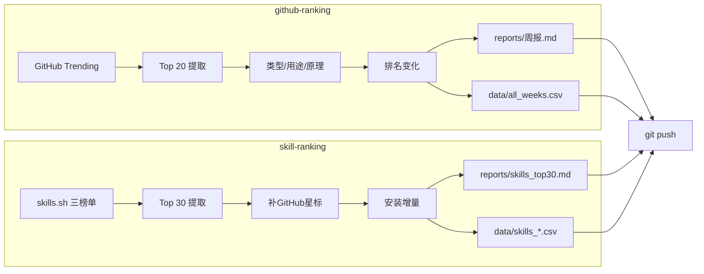

# 📡 oss-radar

> 每周自动追踪 GitHub Trending 和 Agent Skill 生态，分析类型、用途与实现原理，追踪排名变化，洞察技术趋势。

[]()
[]()
[]()

---

## 这是什么

**oss-radar** 是一个每周自动运转的开源生态观察站，包含两个追踪模块：

| 模块 | 追踪什么 | 数据源 | 排名依据 |
|------|----------|--------|----------|
| **github-ranking** | GitHub Trending 周榜 Top 20 | `github.com/trending?since=weekly` | 周新增星标 |
| **skill-ranking** | Agent Skill 安装量 Top 30 | [skills.sh](https://www.skills.sh) 三榜单 + GitHub API | 安装量（星标辅助） |

不只是一份榜单，而是一个**可累积、可检索、可对比**的趋势数据库。

---

## 每期报告包含什么

### GitHub Trending 周报（reports/{week}.md）

| 维度 | 说明 | 示例 |
|------|------|------|
| 排名 | 当期 Top 20 | #1, #2, ... #20 |
| 排名变化 | 与上期对比 | 🆕 新入榜 / ↑3 上升 / ↓2 下降 / — 持平 |
| 类型 | 技术类别 | AI Agent、代码智能、安全测试 |
| 用途 | 一句话说明 | "将代码库索引为持久知识图谱" |
| 实现原理 | 核心技术思路 | "C 高性能解析器构建 AST+符号引用知识图谱" |
| 周增⭐ | 本周新增星标 | 10,483 |
| 总⭐ | 历史总星标 | 127,017 |

### Skill 排名报告（reports/skills_top30.md）

| 维度 | 说明 | 示例 |
|------|------|------|
| 排名 | 安装量 Top 30 | #1, #2, ... #30 |
| 安装量 | skills.sh All Time 安装数 | 2.3M |
| +周增 | 本周安装增量（快照差值） | +15,000 |
| ⭐星标 | GitHub 星标（辅助维度） | 25,064 |
| 三榜单对比 | All Time / Trending 24h / Hot | Top 3 对比 |

---

## 目录结构

```
oss-radar/
├── skills/                          ← 两个可复用的 skill 封装
│   ├── github-ranking/              ← GitHub Trending 追踪
│   │   ├── SKILL.md
│   │   ├── scripts/
│   │   │   ├── run_weekly.py        ← 7步流水线编排
│   │   │   ├── compute_diff.py      ← 排名变化计算
│   │   │   └── append_csv.py        ← CSV追加工具
│   │   └── references/
│   │       ├── manual-steps.md      ← 手动执行步骤
│   │       ├── git-setup.md         ← Git认证配置
│   │       └── analysis-guide.md    ← 分类分析指南
│   └── skill-ranking/               ← Agent Skill 排名追踪
│       ├── SKILL.md
│       ├── scripts/
│       │   ├── fetch_skills_sh.py   ← skills.sh抓取(BeautifulSoup)
│       │   ├── search_skills.py     ← GitHub Search API多策略搜索
│       │   └── run_skill_ranking.py ← 全流程编排
│       └── references/
│           └── analysis-guide.md
├── data/                            ← 数据（按skill隔离）
│   ├── github-ranking/
│   │   ├── all_weeks.csv            ← Trending全量历史（持续追加）
│   │   └── archives/                ← 每期JSON快照
│   │       ├── 2026-W23.json
│   │       └── ...
│   └── skill-ranking/
│       ├── skills_top30.csv         ← Skill Top 30数据
│       ├── skills_sh_all_time.csv   ← All Time榜快照
│       ├── skills_sh_trending_24h.csv ← Trending 24h快照
│       ├── skills_sh_hot.csv        ← Hot榜快照
│       ├── skills_sh_history.csv    ← 三榜单历史快照（含board列）
│       └── skills_sh_raw.json       ← 原始JSON
├── reports/                         ← 报告（共享目录）
│   ├── 2026-W23.md ~ 2026-W27.md    ← Trending周报
│   └── skills_top30.md              ← Skill排名报告
├── docs/
│   └── methodology.md               ← 数据采集方法论
├── README.md
└── .gitignore
```

---

## 数据结构

### github-ranking（all_weeks.csv）

```csv
week,rank,repo,language,weekly_stars,total_stars,category,purpose,principle
2026-W27,1,msitarzewski/agency-agents,Shell,10483,127017,AI Agent 角色库,...
```

### skill-ranking（skills_top30.csv）

```csv
rank,skill,owner_repo,installs,installs_raw,stars,category,purpose,url
1,find-skills,vercel-labs/skills,2300000,2.3M,25064,技能发现工具,...
```

**pandas 一行分析：**

```python
import pandas as pd

# GitHub Trending: 查某项目排名历史
df = pd.read_csv("data/github-ranking/all_weeks.csv")
df[df.repo == "DeusData/codebase-memory-mcp"]

# Skill: 按安装量排序
skills = pd.read_csv("data/skill-ranking/skills_top30.csv")
skills.sort_values("installs", ascending=False).head(10)
```

---

## 更新机制

- **频率**：每周一 09:00（Asia/Shanghai）自动执行
- **github-ranking 流程**：抓取 GitHub Trending → 分析三维度 → 算排名变化 → 生成报告 → 追加 CSV → git push
- **skill-ranking 流程**：抓取 skills.sh 三榜单 → 补 GitHub 星标 → 算安装增量 → 生成报告 → git push



---

## 已覆盖周期

### GitHub Trending

| 周期 | 时间范围 | 冠军项目 | 周增⭐ |
|------|----------|----------|-----:|
| 2026-W23 | 06.01 — 06.07 | chopratejas/headroom | 13,308 |
| 2026-W24 | 06.08 — 06.14 | mvanhorn/last30days-skill | 12,602 |
| 2026-W25 | 06.15 — 06.21 | chopratejas/headroom | 14,982 |
| 2026-W26 | 06.22 — 06.28 | calesthio/OpenMontage | 18,000 |
| 2026-W27 | 06.29 — 07.05 | msitarzewski/agency-agents | 10,483 |

### Skill 排名（首期 W27）

| 榜单 | #1 | #2 | #3 |
|------|-----|-----|-----|
| All Time | find-skills (2.3M 安装) | frontend-design (625.5K) | vercel-react-best-practices (525.7K) |
| Trending 24h | ai-video-generation (22.1K) | viral-hooks (17.9K) | find-skills (12.5K) |
| Hot | ai-avatar-video (958) | find-skills (462) | face-swap (262) |

---

## 如何使用

### 浏览报告

直接阅读 `reports/` 目录下的 md 文件：
- `2026-W27.md` — GitHub Trending 周报
- `skills_top30.md` — Skill 排名报告

### 数据分析

```bash
git clone https://github.com/shouyuandong/oss-radar.git
cd oss-radar

# GitHub Trending 分析
python3 -c "
import pandas as pd
df = pd.read_csv('data/github-ranking/all_weeks.csv')
print(df.groupby('category').size().sort_values(ascending=False).head(10))
"

# Skill 排名分析
python3 -c "
import pandas as pd
df = pd.read_csv('data/skill-ranking/skills_top30.csv')
print(df[['rank','skill','installs','stars']].head(10))
"
```

### 接入 Obsidian / 知识库

- 用 [Obsidian Git](https://github.com/Vinzent03/obsidian-git) 插件自动 pull
- 或用 git subtree 嵌入你的笔记仓库子目录
- 详见 [Obsidian Git 配置指引](docs/obsidian-setup.md)

---

## 两个 Skill 的复用

每个 skill 都可独立运行，方便 fork 后自定义：

### github-ranking skill

```bash
# 手动运行完整流水线
python3 skills/github-ranking/scripts/run_weekly.py --top 20

# 只算排名变化
python3 skills/github-ranking/scripts/compute_diff.py --week 2026-W28
```

### skill-ranking skill

```bash
# 抓取 skills.sh 三榜单
python3 skills/skill-ranking/scripts/fetch_skills_sh.py --output data/skill-ranking/

# GitHub Search API 多策略搜索（补充星标数据）
python3 skills/skill-ranking/scripts/search_skills.py --top 30 --output data/skill-ranking/
```

---

## 如何贡献

欢迎通过 PR 贡献：

- **补充分析**：对项目的用途/原理有更准确的理解
- **新增字段**：如 `topics`、`license`、`company`
- **趋势洞察**：跨周期的有趣规律
- **历史数据**：W22 及更早的 Trending 存档
- **skills.sh 解析**：HTML 结构变化时更新解析逻辑

commit message 格式：`feat(W28): 新增第28期报告` / `fix: 修正某项目分类`

---

## 数据说明

- **W23-W26** GitHub Trending 历史数据来自 [git-trending-rank.github.io](https://git-trending-rank.github.io/categories/weekly/) 真实存档
- **W27 起** 为实时抓取 `github.com/trending?since=weekly`
- **Skill 排名** 数据来自 [skills.sh](https://www.skills.sh)（Vercel Labs 维护，57000+ skills）
- **安装量** = `npx skills add` 安装次数；**星标** = GitHub stars
- skills.sh 无官方 API，通过 HTML 解析获取，结构变化时可能需要调整
- `category`/`purpose`/`principle` 为 AI 辅助分析，仅供参考

## License

MIT
